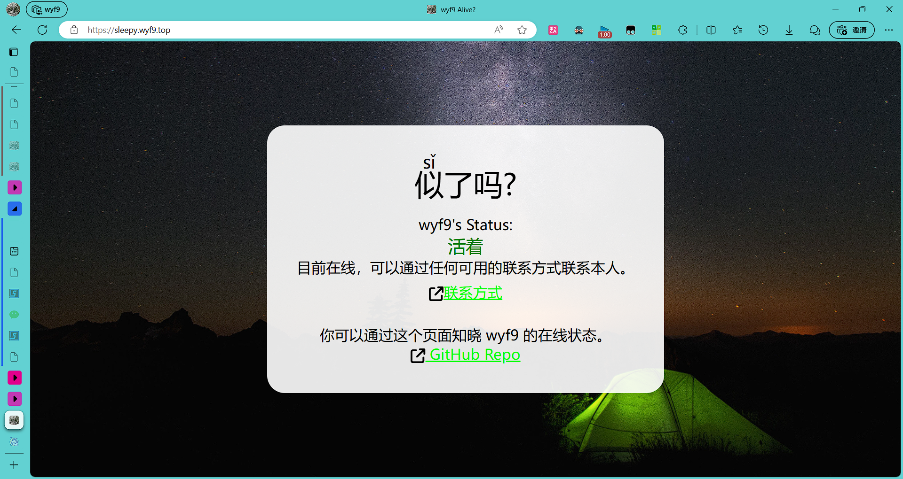
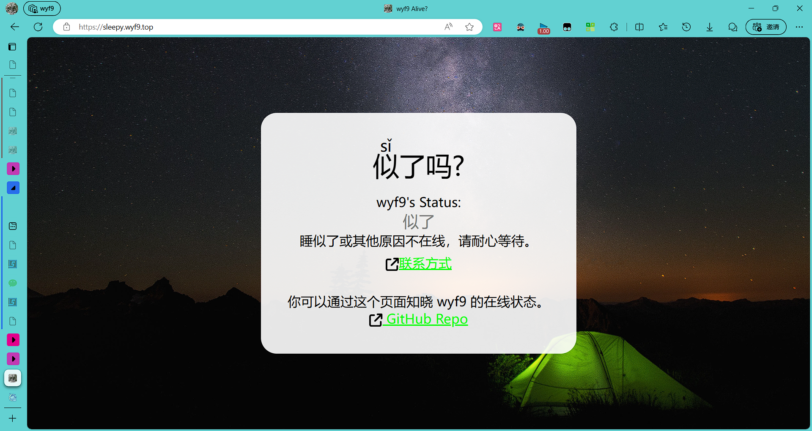
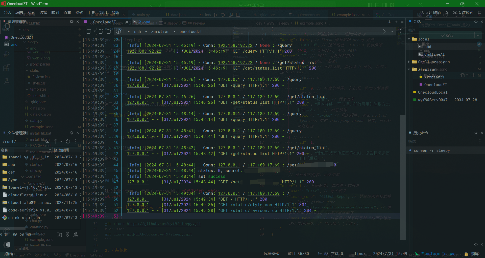
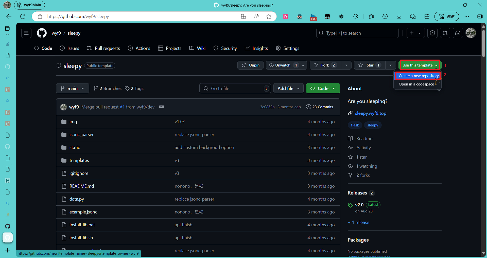

# sleepy

> Are you sleeping?

一个查看个人在线状态的 Flask 网站，让他人能知道你不在而不是故意吊他/她

[**演示**](#preview) / [**部署**](#部署) / [**使用**](#使用) / [**关于**](#关于)

<!-- > ver: `2.0`, configver: `2` -->

## Preview

演示站: [Here](https://sleepy.wyf9.top)

网页:





服务器:



## 部署

> [!WARNING]
> 如果要创建自用的 repo 而不是贡献此仓库, 建议使用模板创建而非直接 Fork (Fork 不能设置私有, 意味着 *他人可以看到你的配置信息, **包括 `secret`***)

- 使用模板创建: [link here](https://github.com/new?template_name=sleepy&template_owner=wyf9) or 直接选择右上角的 `Use this template`:



进入 repo 创建页, 即可选择仓库类型为 `Private`.

---

理论上全平台通用, 安装了 Python >= **3.6** 即可

1. Clone 本仓库 (建议先 Fork / Use this template)

```shell
git clone https://github.com/wyf9/sleepy.git
# or ssh:
# git clone git@github.com:wyf9/sleepy.git
```

2. 安装依赖

```shell
cd sleepy
./install_lib.sh
# or windows:
# .\install_lib.bat
# 也可自行安装: pip install -r requirements.txt
# 其实只有 Flask (目前)
```

3. 编辑配置文件

先启动一遍程序:

```shell
python3 server.py
```

如果不出意外，会提示: `data.json not exist, creating`，同时目录下出现 `data.json` 文件，编辑该文件中的配置并重新运行即可 (示例请 [查看 `example.jsonc`](./example.jsonc) )

## 使用

有两种启动方式:

- 直接启动

```shell
python3 server.py
```

- 简易启动器

```shell
python3 start.py
```

相比直接启动, 启动器可实现在服务器退出 *(如开启 debug 后更改时自动保存导致有语法错误)* 后自动重启

<details>
<summary>点击展开</summary>

```shell
Server path: /mnt/usb16/dev/wyf9/sleepy/server.py
Starting server #1
 * Serving Flask app 'server'
 * Debug mode: on
WARNING: This is a development server. Do not use it in a production deployment.rUse a production WSGI server instead.
 * Running on all addresses (0.0.0.0)
 * Running on http://127.0.0.1:9010
 * Running on http://192.168.1.20:9010
Press CTRL+C to quit
 * Restarting with stat
 * Debugger is active!
 * Debugger PIN: 114-514-191
^C#1 exited with code 2
waiting 5s
Starting server #2
 * Serving Flask app 'server'
 * Debug mode: on
WARNING: This is a development server. Do not use it in a production deployment. Use a production WSGI server instead.
 * Running on all addresses (0.0.0.0)
 * Running on http://127.0.0.1:9010
 * Running on http://192.168.1.20:9010
Press CTRL+C to quit
 * Restarting with stat
 * Debugger is active!
 * Debugger PIN: 114-514-191
```

</details>


默认服务 http 端口: `9010`

| 路径                                   | 作用                |
| -------------------------------------- | ------------------- |
| `/`                                    | 显示主页            |
| `/query`                               | 获取状态            |
| `/get/status_list`                     | 获取可用状态列表    |
| `/set?secret=<secret>&status=<status>` | 设置状态 (url 参数) |
| `/set/<secret>/<status>`               | 设置状态 (路径)     |

1. `/query`:

获取当前的状态 (无需鉴权)

返回 json:

```jsonc
{
    "success": true, // 请求是否成功
    "status": 0, // 获取到的状态码
    "info": { // 对应状态码的信息
        "name": "活着", // 状态名称
        "desc": "目前在线，可以通过任何可用的联系方式联系本人。", // 状态描述
        "color": "awake"// 状态颜色, 对应 static/style.css 中的 .sleeping .awake 等类
    }
}
```

2. `/get/status_list`

获取可用状态的列表 (无需鉴权)

返回 json:

```jsonc
[
    {
        "id": 0, // 索引，取决于配置文件中的有无
        "name": "活着", // 状态名称
        "desc": "目前在线，可以通过任何可用的联系方式联系本人。", // 状态描述
        "color": "awake" // 状态颜色, 对应 static/style.css 中的 .sleeping .awake 等类
    }, 
    {
        "id": 1, 
        "name": "似了", 
        "desc": "睡似了或其他原因不在线，紧急情况请使用电话联系。", 
        "color": "sleeping"
    }, 
    // 以此类推
]
```

> 就是返回 `data.json` 中的 `status_list` 列表

3. `/set?secret=<secret>&status=<status>`

设置当前状态

- `<secret>`: 在 `data.json` 中配置的 `secret`
- `<status>`: 状态码 *(`int`)*

返回 json:

```jsonc
// 1. 成功
{
    "success": true, // 请求是否成功
    "code": "OK", // 返回代码
    "set_to": 0 // 设置到的状态码
}

// 2. 失败 - 密钥错误
{
    "success": false, // 请求是否成功
    "code": "not authorized", // 返回代码
    "message": "invaild secret" // 详细信息
}

// 3. 失败 - 请求无效
{
    "success": false, // 请求是否成功
    "code": "bad request", // 返回代码
    "message": "argument 'status' must be a number" // 详细信息
}
```

4. `/set/<secret>/<status>`

同上 `3.`, 唯一的不同是 url 格式

## 客户端示例

在 `_example/` 目录下, 可参考

## 关于

本项目灵感由 Bilibili UP @ [WinMEMZ](https://space.bilibili.com/417031122) 而来: [site](https://maao.cc/sleepy/) / [blog](https://www.maodream.com/archives/192/), 并~~部分借鉴~~使用了前端代码, 在此十分感谢。

如有 Bug / 建议, 请 [issue](https://github.com/wyf9/sleepy/issues/new) or [More contact](https://wyf9.top/#/contact).